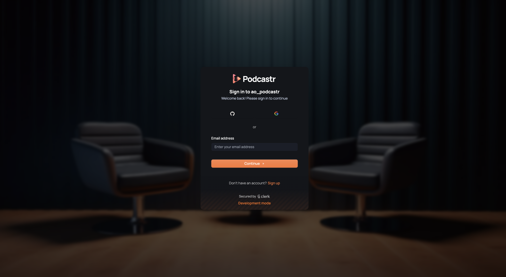
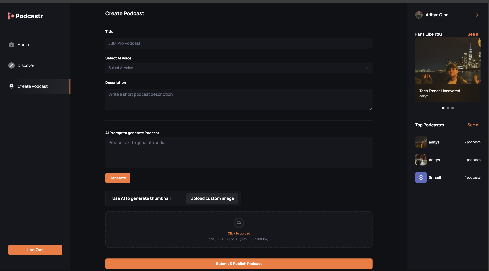
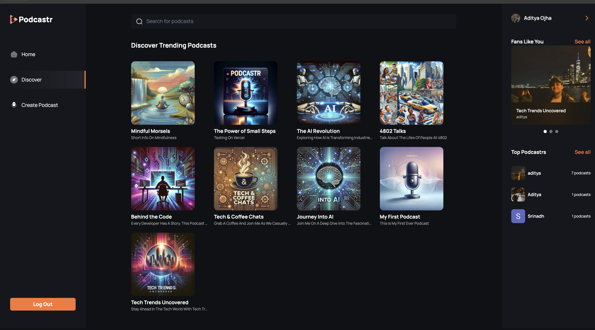
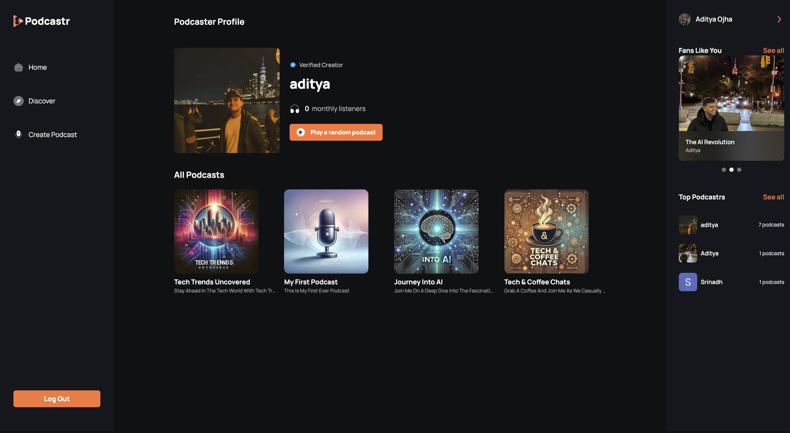

# 🎙️ Podcastr – AI-Powered Podcasting Platform  

  

Podcastr is an **AI-powered SaaS platform** designed to simplify podcast creation, editing, and distribution. Whether you're an individual podcaster or a production team, Podcastr offers an intuitive, cloud-based environment to **record, edit, transcribe, and publish** podcasts effortlessly.  

With real-time collaboration, AI-enhanced sound generation, and seamless distribution, Podcastr aims to be the go-to tool for modern podcasters.  

---

## 🚀 Features  

### 🎧 AI-Powered Podcast Editing  
- ✅ Automatically **remove background noise**, enhance audio clarity, and normalize volume.  
- ✅ AI-based **speech-to-text transcription** for generating captions and show notes.  

### 👥 Real-Time Collaboration  
- ✅ Invite team members to **edit, annotate, and manage** podcast episodes together.  
- ✅ Live preview for quick iterations.  

### 🔊 Multi-Format Support  
- ✅ Supports **MP3, WAV, AAC, and FLAC** for uploads and exports.  
- ✅ **Automated format conversion** for easy publishing.  

### ☁️ Cloud-Based & Secure  
- ✅ No need to worry about storage; all data is stored **securely in the cloud**.  
- ✅ **Multi-device support**—work on your podcast from anywhere.  


---

## 🛠️ Tech Stack  

Podcastr is built with modern, scalable technologies:  

- **Frontend:** [Next.js](https://nextjs.org/) (React-based SSR framework)  
- **Backend:** [Convex](https://convex.dev/) (Serverless backend and database)  
- **Styling:** [Tailwind CSS](https://tailwindcss.com/) (Utility-first CSS framework)  
- **State Management:** React Context API + Custom Hooks  
- **Hosting & Deployment:** [Vercel](https://vercel.com/) (Optimized for Next.js)  

---

## 📸 Screenshots  

### 🔑 Sign In / Sign Up Page  
Seamless and secure authentication for podcasters.  
  

### 🏠 Home Page  
Discover and manage your podcasts in a modern, intuitive interface.  
  

### 🎤 Create Podcast Page  
Set up a new podcast with a guided step-by-step process.  
  

### 🔎 Discover Page  
Explore trending and recommended podcasts tailored to your interests.  
  

### 👤 Profile Page  
Manage your profile, settings, and podcast subscriptions.  
  

---

## 📦 Installation & Setup  

### 1️⃣ Clone the Repository  
```sh  
git clone https://github.com/AdityaOjhalang/Podcastr.git  
cd Podcastr  
```

### 2️⃣ Install Dependencies  
```sh  
npm install  
```

### 3️⃣ Run the Development Server  
```sh  
npm run dev  
```
The app will be available at [http://localhost:3000](http://localhost:3000).  

---

## 🏗️ Roadmap  

- [ ] 🎙️ **AI Voice Cloning** – Generate podcast voices from text input.  
- [ ] 📝 **Automated Show Notes** – AI-generated summaries for each episode.  
- [ ] 🎵 **Royalty-Free Music Library** – Integrated background music & sound effects.  
- [ ] 📊 **Podcast Analytics** – Insights on listener engagement & retention.  
- [ ] 🌎 **Multi-Language Support** – AI-driven translations & multilingual subtitles.  
- [ ] 🎭 **AI-Powered Voice Effects** – Modify voice tone, pitch, and clarity.  

---

## 🛠️ Contributing  

We welcome contributions from the community! To contribute:
1. Fork the repository.  
2. Create a new branch: `git checkout -b feature-branch-name`.  
3. Make your changes and commit: `git commit -m 'Add some feature'`.  
4. Push to the branch: `git push origin feature-branch-name`.  
5. Submit a pull request!  

---

## 📞 Contact  

For inquiries, feature requests, or support, reach out via:  
- GitHub Issues: [Podcastr Issues](https://github.com/AdityaOjhalang/Podcastr/issues)  
- Email: [aditya.ojha@nyu.edu](mailto:aditya.ojha@nyu.edu)  

Happy Podcasting! 🎙️🚀  
